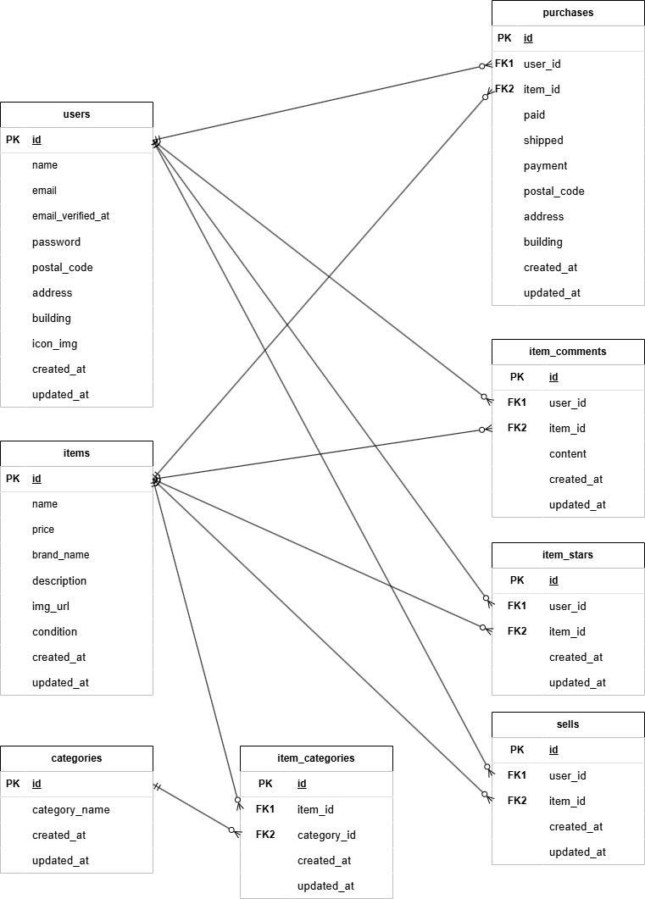

# first-laravel

## 環境構築
Dockerビルド
1. git clone [git@github.com:Takaaki39/confirmation-test.git](https://github.com/Takaaki39/fleamarket-app.git)
2. cd fleamarket-app/fleamarket/
3. docker-compose up -d --build

※MySQLはOSによって起動しない場合があるのでそれぞれのPCに合わせてdocker-compose.ymlファイルを編集してください。

Laravel環境構築
1. docker-compose exec php bash
2. composer install
3. cp .env.example .env
4. php artisan key:generate
5. php artisan migrate
6. php artisan db:seed
7. php artisan storage:link //storageの画像を使えるようにする
8. composer require stripe/stripe-php //stripe SDKインストール
9. ※windowsの場合 :
     exitで抜けた後 sudo chmod -R 777 *

テストアカウント
1. TestUser1
     ・ email: test_user1@example.com
     ・ password: password
2. TestUser2
     ・ email: test_user2@example.com
     ・ password: password

UnitTest
1. DB作成
2. cp .env .env.testing
3. php artisan key:generate --env=testing
4. php artisan config:clear
5. php artisan migrate --env=testing

テスト実行
1. php artisan config:clear
2. vendor/bin/phpunit tests/Feature/FleaMarketTest.php

## 使用技術(実行環境)
- php 8.1.33
- Laravel 8.83.29
- MySQL 8.0.26

## ER図

## URL
- 開発環境：http://localhost/
- phpMyAdmin：http://localhost:8080/
- MailHog：http://localhost:8025/
##

