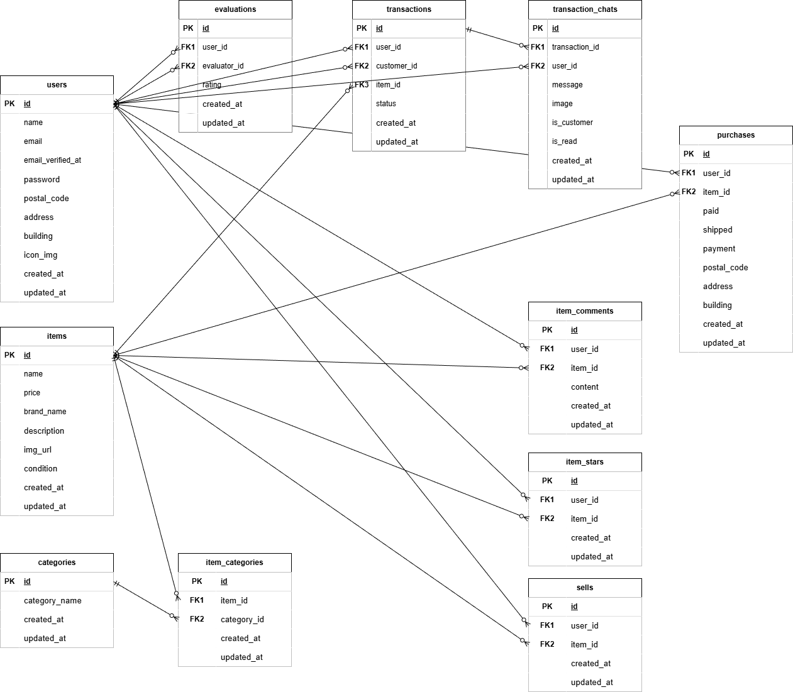

# フリマアプリ

## 環境構築
Dockerビルド
1. git clone git@github.com:Takaaki39/fleamarket-app.git
2. cd fleamarket-app/
3. docker-compose up -d --build

※エラー(Error response from daemon: Conflict.)が出た場合はdocker-compose downなどしてコンフリクトしてるコンテナを削除して再度3.を実行してください。

※MySQLはOSによって起動しない場合があるのでそれぞれのPCに合わせてdocker-compose.ymlファイルを編集してください。

### Laravel環境構築
1. docker-compose exec php bash
2. composer install
3. cp .env.example .env
4. php artisan key:generate
5. php artisan migrate
6. php artisan db:seed
7. php artisan storage:link
8. composer require stripe/stripe-php
9. exit
10. ※windowsの場合 : sudo chmod -R 777 *
11. ./set_stripe_key.sh

### テストアカウント
1. TestUser1
     + email: test_user1@example.com
     + password: password
2. TestUser2
     + email: test_user2@example.com
     + password: password
2. TestUser3
     + email: test_user3@example.com
     + password: password

### 取引チャット
1. 商品詳細画面にある取引を開始するボタンを押す。またはマイページの取引中の商品で商品を選択する
2. 画面下のメッセージと画像があれば選択して送信する。
3. 購入者の場合、取引が完了したら取引完了ボタンを押して取引相手の評価を送る。
4. 出品者の場合、購入者の取引が完了したらメールが届く。取引完了後にチャット画面を開くと取引相手の評価を送れるようになる。

### テスト準備
1. docker-compose exec mysql bash
2. mysql -u root -p
3. パスワードはroot
4. CREATE DATABASE fleamarket_test;
5. exit 2回
6. docker-compose exec php bash
7. php artisan key:generate --env=testing
8. php artisan config:clear
9. php artisan migrate --env=testing

### テスト実行
1. php artisan config:clear
2. vendor/bin/phpunit tests/Feature/FleaMarketTest.php

## 使用技術(実行環境)
- php 8.1.33
- Laravel 8.83.29
- MySQL 8.0.26
- MailHog
- stripe

## ER図

## URL
- 開発環境：http://localhost/
- phpMyAdmin：http://localhost:8080/
- MailHog：http://localhost:8025/
##

